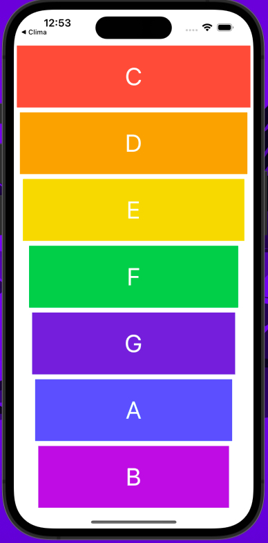
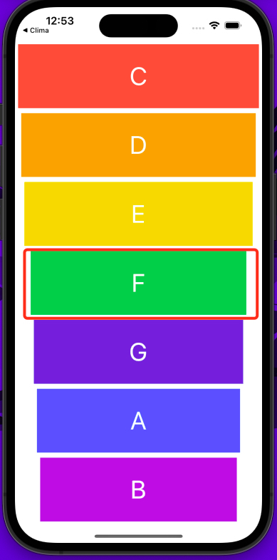

# Weather App

**Table of Contents**
- [Introduction](#introduction)
- [Motivation](#motivation)
- [Technology Used](#technologyUsed)
- [Build Status](#buildStatus)
- [Features](#features)
- [Installation](#installation)
- [Execution](#execution)

## Introduction 
Mobile app where users can play the Xylophone.

## Motivation 
This is a personal learning project aimed to teach me how to play sound using an Apple library called AVFoundation.

## Technology Used 
<table>
  <tbody>
    <tr>
      <td>Language</td>
      <td>Swift</td>
    </tr>
    <tr>
      <td>Notable Technology Utilized</td>
      <td>
        <ul>
          <li>Swift Language + Storyboard</li>
          <li>Layout and constraint designing</li>
          <li>AVFoundation package to play sounds</li>
          <li>Error handling</li>
        </ul>
      </td>
    </tr>
  </tbody>
</table>

## Build Status 
Project is completed.

## Features 
- Play different sounds of a Xylophone

### Play different sounds of a Xylophone

* User can touch each Xylophone letter displayed and it will play the sound of that note
* The package used is the AVFoundation

# Installation 
* Ensure XCode is installed (only available on MacOS)

# Execution 
* Open the "Xylophone.xcodeproj" file in XCode
* Once the project is open you can click the play button at the top of the IDE to run the iPhone simulator or use a physical device
